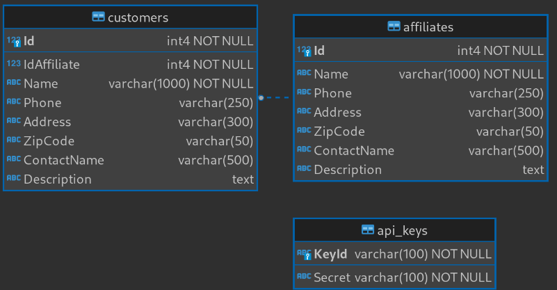

# Affiliate Program Management System

## Data Tables

## Configuation

In DataAcceess and API, edit file appsettings.json and put a valid PostgreSQL Connection String.

## Test

You can use /assets/APMS.postman_collection.json file to test te APIs in Postman.

## Build

You can use docker to build this project using provided Dockerfile.